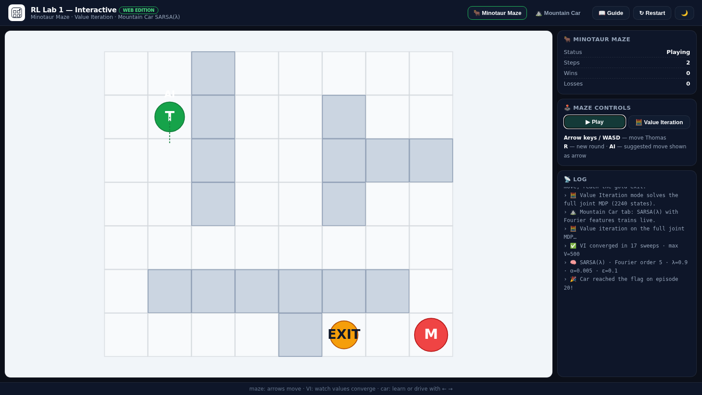
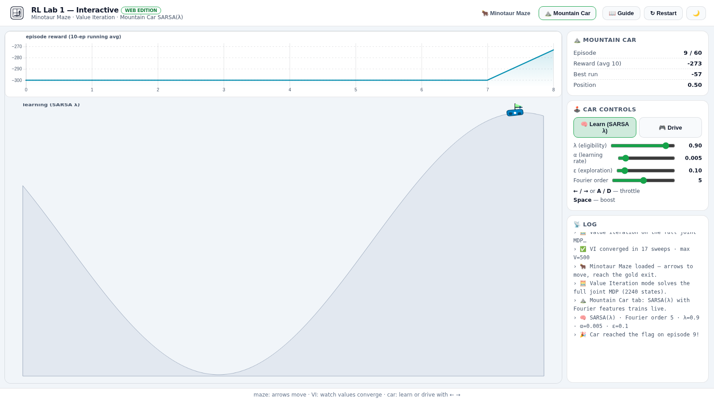
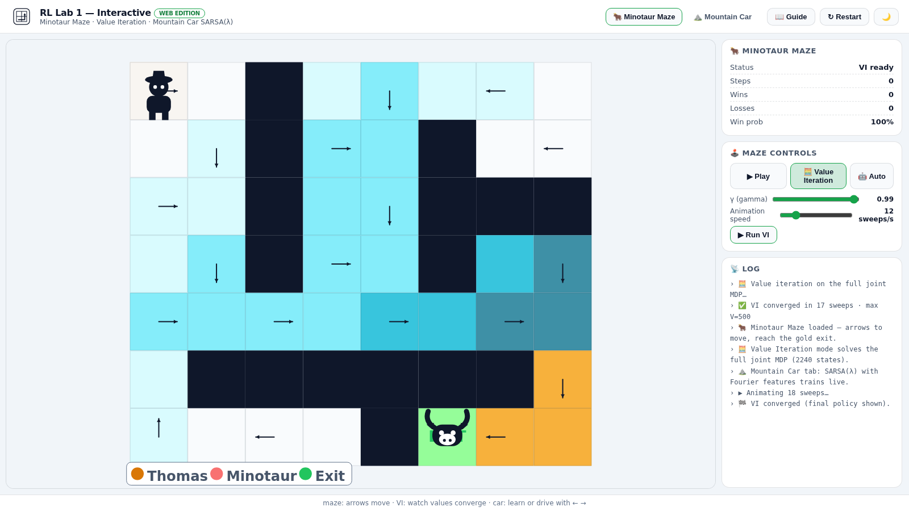

# 🧠 RL Lab 1 — Reinforcement Learning (KTH/UPM, 2021)

[](https://www.python.org/)
[](tests/)
[](https://alejp1998.github.io/rl_lab1/)

> **▶️ Play it live:** <https://alejp1998.github.io/rl_lab1/> — the whole lab runs in your browser (Minotaur Maze + Mountain Car).

Two classic reinforcement learning problems solved from scratch:

| Problem | Task | Method |
|---|---|---|
| **1 — Minotaur Maze** | Thomas must reach the exit while a minotaur wanders the maze | Full joint-MDP **value iteration**, compared against Q-learning and SARSA |
| **2 — Mountain Car** | A weak car must climb a steep hill by building momentum | **SARSA(λ)** with a **Fourier linear basis**, Nesterov momentum and eligibility traces |

Team: Alejandro Jarabo-Peñas · Xavi de Gibert Duart (KTH Royal Institute of Technology, 2021).

### 🖼️ Screenshots

| Minotaur Maze | Mountain Car |
|---|---|
|  |  |

| Value Iteration | |
|---|---|
|  | |
## 🎮 Interactive web edition

The whole lab is playable in the browser at
**[https://alejp1998.github.io/rl_lab1/](https://alejp1998.github.io/rl_lab1/)**:

- **🐂 Minotaur Maze — Play**: drive Thomas with the arrow keys while the minotaur
  chases; the sidebar tracks wins/losses and the **AI suggestion** arrow shows what
  the optimal policy would do.
- **🧮 Value Iteration**: solve the full 2240-state joint MDP live — watch the
  V-value heatmap converge sweep by sweep with the optimal policy arrows overlaid.
- **⛰️ Mountain Car — Learn**: the lab's SARSA(λ) with Fourier features trains in
  your browser (adjust λ, α, ε and the basis order) with a live reward curve;
  **Drive** mode lets you throttle the car manually.

The JavaScript implementation (`webgame/js/rl1-core.js`) is a **1:1 port** of the
Python code — same state space, same Bellman backups, same trace update — with a
matching `node:test` suite.

## 🧪 Quality gates

```bash
pip install -e ".[dev]"
pytest -q -m "not slow"   # fast tests
pytest -q                 # + training test (~6s)
ruff check .
node --test webgame/tests/*.test.js
```

- `problem_1.ipynb` executes end-to-end (103 cells, 0 errors) with `numpy<2`
  (the 2021 code uses `np.Inf` / gym 0.25 APIs removed in NumPy 2 / gymnasium).
- Fixed `np.Inf` → `np.inf` for NumPy 2 compatibility.

## 📁 Layout

```
problem1/  minoutaur_maze.py + problem_1.ipynb (Minotaur Maze)
problem2/  eligibility_sarsa.py + problem_2.py (Mountain Car, Fourier basis)
tests/     pytest suite (env + algorithms)
webgame/   interactive Pixi-free canvas edition + JS core + node tests
```
